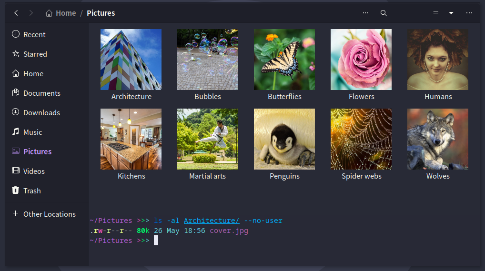

# go-thumbnailer

A cover thumbnailer written in Go for performance and reliability.



## Installation

Run `make install` to create an installable package from the PKGBUILD and install it.

```fish
git clone https://github.com/donovanglover/go-thumbnailer
cd go-thumbnailer && make install
```

The source code is short and simple so it's easy to verify. Manual installation is possible but not recommended.

## Installing manually

First install the dependency [libvips](https://github.com/libvips/libvips) and build the binary with `go build`. Then, copy the executable and thumbnailer to your /usr directory, like so:

```fish
sudo install -Dm755 go-thumbnailer /usr/bin/go-thumbnailer
sudo install -Dm644 go.thumbnailer /usr/share/thumbnailers/go.thumbnailer
```

If you're using a non-Arch distribution, feel free to [create your own package](https://wiki.archlinux.org/title/Creating_packages_for_other_distributions) for go-thumbnailer.

## Purpose

Images are a great way to make browsing through directories easier, especially when each directory holds specific content, such as a certain music album, video series, or other media.

With go-thumbnailer, any `cover.jpg` or `cover.png` you place in a directory will replace the default folder icon in nautilus with a thumbnail of that image.

This means that you can use high quality cover images, and go-thumbnailer will automatically generate proper thumbnails for them.

## Why go-thumbnailer?

- Portability. Your folder icons are now part of the folders themselves, instead of [hidden](https://askubuntu.com/questions/153575/where-does-gnome-nautilus-store-directory-icons) inside of GNOME's virtual file system. No effort from you is required to keep your folder icons.
- Simplicity. Using a cover image is as simple as making sure that the directory has a `cover.jpg` or `cover.png`. No need to click through GUIs or deal with a database.
- Ease of sharing. You can share folders without worrying about useless metadata files like desktop.ini. Any other user that uses go-thumbnailer will automatically see your cover images.
- Progressive enhancement. You can use go-thumbnailer at your own pace, gradually adding cover images as you see fit.
- Graceful degradation. Your files are exactly the same as they were with or without go-thumbnailer.
- Multiuse. The same cover images can be used with other applications such as [mpv](https://github.com/mpv-player/mpv) (enabled by default) and media servers like [Navidrome](https://github.com/navidrome/navidrome).

## Comparison to cover-thumbnailer

[cover-thumbnailer](https://github.com/flozz/cover-thumbnailer) is a similar project written in Python. Unlike cover-thumbnailer, go-thumbnailer includes neither a GUI nor settings for the user.

go-thumbnailer is faster and focuses on providing a universal experience for cover images, following an "it just works" philosophy with no manual configuration necessary.
